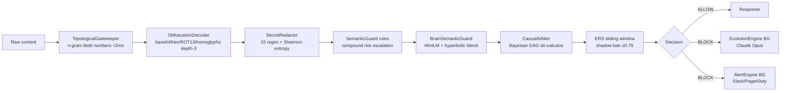

# System Architecture Overview

Shadow Warden is a 9-layer AI security gateway running as 11 Docker services.

---

## High-Level Architecture

```mermaid
graph TB
    subgraph Clients
        A[App / API caller]
        B[Obsidian Plugin]
        C[SOVA cron jobs]
    end

    subgraph Proxy["Caddy Proxy :80/:443"]
        P[QUIC/HTTP3 · HSTS]
    end

    subgraph Warden["Warden Gateway :8001"]
        F[POST /filter]
        G[POST /community/*]
        H[POST /security/*]
        I[POST /agent/sova]
        J[/soc/* · /xai/* · /sep/* · ...]
    end

    subgraph Pipeline["Filter Pipeline (&lt;10ms)"]
        L1[TopologicalGatekeeper]
        L2[ObfuscationDecoder]
        L3[SecretRedactor]
        L4[SemanticGuard rules]
        L5[BrainSemanticGuard MiniLM]
        L6[CausalArbiter Bayesian]
        L7[ERS sliding window]
        L1-->L2-->L3-->L4-->L5-->L6-->L7
    end

    subgraph Workers["ARQ Worker"]
        W1[moderate_post NIM/SemanticGuard]
        W2[scan_cves OSV API]
        W3[sova_morning_brief]
        W4[sova_community_watchdog]
        W5[reap_expired_tunnels]
    end

    subgraph Storage
        R[(Redis)]
        DB[(PostgreSQL)]
        M[(MinIO S3)]
        SQ[(SQLite community/sep/healer)]
    end

    A & B & C --> P --> Warden
    F --> Pipeline
    Warden --> Workers
    Workers --> Storage
    Pipeline --> Storage
```

---

## Service Map

| Service | Port | Image | Purpose |
|---------|------|-------|---------|
| `proxy` | 80/443 | Caddy v2.8 | TLS termination, QUIC/HTTP3 |
| `warden` | 8001 | MCR Playwright | FastAPI gateway + 9-layer pipeline |
| `app` | 8000 | Python slim | Application layer |
| `analytics` | 8002 | Python slim | Analytics API |
| `dashboard` | 8501 | Python slim | Streamlit dashboard |
| `postgres` | 5432 | postgres:16 | Structured data |
| `redis` | 6379 | redis:7 | Cache, ERS, session memory |
| `prometheus` | 9090 | prom/prometheus | Metrics scrape |
| `grafana` | 3000 | grafana/grafana | Dashboards + SLO alerts |
| `minio` | 9000/9001 | minio/minio | Evidence vault, screencasts |
| `minio-init` | — | mc | Bucket bootstrap |

---

## Data Flow: Filter Request



---

## Security Zones

| Zone | Description |
|------|-------------|
| **Public** | `/filter`, `/community/feed`, `/security/posture` |
| **Authenticated** | All endpoints requiring `X-API-Key` |
| **Admin** | `DELETE /community/posts`, `POST /security/cve-scan`, `POST /soc/heal` — require `X-Admin-Key` |
| **Internal** | `/soc/*` — intended for VPN-only access in production |
| **SOVA** | `/agent/sova` — requires `ANTHROPIC_API_KEY` |
