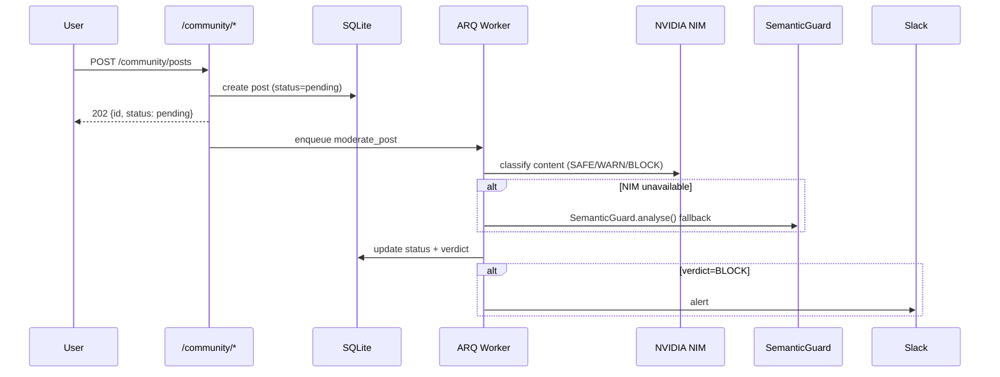

# Business Community Guide

The Business Community module provides a tenant-isolated forum with AI-powered
content moderation via NVIDIA NIM (Nemotron) and an Obsidian bridge for sharing
notes directly to the community.

---

## Architecture



---

## Endpoints

### Create a post

```bash
POST /community/posts
Content-Type: application/json

{
  "author_id": "user-123",
  "content":   "Security tip: always rotate your API keys every 90 days.",
  "source":    "manual"
}
```

Response `202`:
```json
{ "id": "abc123", "status": "pending", "message": "Post queued for moderation" }
```

### Post from Obsidian

```bash
POST /community/posts/from-obsidian
Content-Type: application/json

{
  "author_id":    "user-123",
  "note_content": "# API Security\n...",
  "filename":     "api-security.md"
}
```

!!! warning "Automatic secret scanning"
    The Obsidian bridge runs `scan_note()` before creating the post.
    If the note contains API keys, passwords, or CLASSIFIED data, the request
    is rejected with `422 secrets_detected`.

### Get the feed

```bash
GET /community/feed?limit=50&offset=0
```

Only `approved` posts are returned. Pending and blocked posts are excluded.

### Add a comment

```bash
POST /community/posts/{post_id}/comment
Content-Type: application/json

{ "author_id": "user-456", "content": "Great tip!" }
```

!!! info
    Comments are only allowed on posts with `status=approved`.

### Admin: block a post

```bash
DELETE /community/posts/{post_id}
X-Admin-Key: your-admin-key
```

---

## Moderation Pipeline

| Step | Description |
|------|-------------|
| 1. NIM Nemotron | Calls `NimClient().chat()` with structured prompt → SAFE / WARN / BLOCK + score |
| 2. Fallback | If `NVIDIA_API_KEY` absent → `SemanticGuard.analyse()` → maps LOW/MEDIUM/HIGH |
| 3. Status update | `pending → approved` (SAFE) · `pending` (WARN) · `blocked` (BLOCK) |
| 4. Slack alert | On BLOCK verdict, sends post ID + reason to `SLACK_WEBHOOK_URL` |

### Verdict mapping

| NIM Verdict | Score | Post Status |
|-------------|-------|-------------|
| SAFE | 0.0–0.49 | `approved` |
| WARN | 0.50–0.84 | `pending` |
| WARN | ≥ 0.85 | `blocked` (SOVA auto-block) |
| BLOCK | any | `blocked` |

---

## SOVA Community Tools

SOVA has 6 tools for autonomous community management:

| Tool | Purpose |
|------|---------|
| `get_community_feed` | Read approved/pending feed |
| `get_community_post` | Inspect a post before acting |
| `moderate_community_post` | Block or requeue posts |
| `list_community_posts_members` | Member roster |
| `community_moderation_report` | Health digest for morning brief |
| `post_community_announcement` | Post as SOVA |

### Community Watchdog Cron

`sova_community_watchdog` runs every hour at `:20 UTC`:

- Fetches the approved feed
- Auto-blocks any WARN post with `nim_score ≥ 0.85`
- Sends Slack alert when BLOCK verdicts are present
- No LLM calls on the happy path — pure HTTP

---

## Member Management

```bash
# Register a member
POST /community/members
{ "user_id": "u1", "display_name": "Alice", "role": "member" }

# List members
GET /community/members
```

Roles: `member` · `moderator` · `admin`
