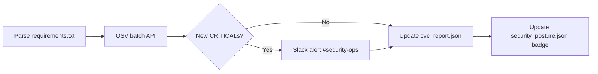

# Cyber Security Hub Guide

The Cyber Security Hub provides a public security posture page, automated CVE
scanning via the OSV API, an internal SOC dashboard, and a pentest findings
timeline.

---

## Security Posture Badge

The badge is computed from the latest CVE scan:

| Badge | Condition |
|-------|-----------|
| 🟢 GREEN | 0 critical CVEs |
| 🟡 YELLOW | 1–3 critical CVEs, or ≥ 5 high CVEs |
| 🔴 RED | ≥ 4 critical CVEs |

```bash
GET /security/posture
```

```json
{
  "badge": "GREEN",
  "cve_counts": { "critical": 0, "high": 2, "medium": 5, "total": 7 },
  "last_scan": "2026-05-04T08:10:00Z",
  "certifications": [
    { "name": "SOC 2 Type II", "status": "in_progress", "link": "/docs/soc2-evidence" },
    { "name": "GDPR Art. 35",  "status": "compliant",   "link": "/docs/dpia" },
    { "name": "OWASP LLM Top 10", "status": "compliant", "link": "/docs/security-model" }
  ]
}
```

The badge auto-updates within 15 minutes of a new CVE scan.

---

## CVE Scanner

`scan_cves` is an ARQ background job that runs every 6 hours (at `:10` past
00:00, 06:00, 12:00, 18:00 UTC).



### Trigger on demand (admin)

```bash
POST /security/cve-scan
X-Admin-Key: your-admin-key
```

Returns `{ "queued": true }` when ARQ is available, or runs inline if not.

### CVE Feed

```bash
GET /security/cve-feed?severity=CRITICAL&limit=10
```

Each finding includes package name, version, OSV ID, aliases, severity,
summary, and a direct OSV link.

---

## SOC Dashboard

Internal endpoints for the Security Operations Centre sidebar.

!!! warning "Access control"
    Deploy the SOC dashboard behind your VPN. The read endpoints are open;
    write endpoints (`POST /soc/heal`) require `X-Admin-Key`.

### Core health snapshot

```bash
GET /soc/health
```

Returns circuit breaker state, bypass rate (last 1 min), active ERS bans,
requests per minute, and block rate. Designed for ≤ 30s auto-refresh.

### WardenHealer report

```bash
GET /soc/healer
```

Last `WardenHealer` diagnostic run: issues detected, actions taken,
incident classification (Claude Haiku), and trend prediction.

### Trigger Healer manually

```bash
POST /soc/heal
X-Admin-Key: your-admin-key
```

---

## Pentest Findings

### View findings (public, redacted by default)

```bash
GET /security/pentest?status=remediated&redacted=true
```

Redacted response omits `summary` — shows only title, severity, status,
CVE ID, and remediation date. Safe for public display.

### Add a finding (admin)

```bash
POST /security/pentest
X-Admin-Key: your-admin-key
Content-Type: application/json

{
  "title":         "SQL injection in legacy /api/report endpoint",
  "severity":      "HIGH",
  "status":        "remediated",
  "summary":       "Parameterised queries added; input validation enforced.",
  "remediated_at": "2026-04-15",
  "cve_id":        null
}
```

---

## Compliance Controls

```bash
GET /security/compliance
```

Returns SOC 2, GDPR, and OWASP LLM Top 10 control statuses with links to
evidence documents. All controls map directly to entries in
[docs/soc2-evidence.md](../soc2-evidence.md).
