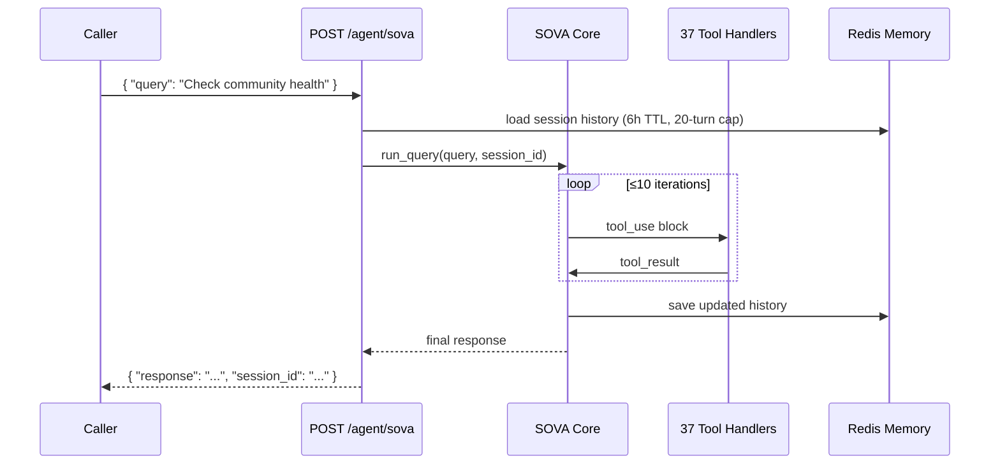

# SOVA Agent Guide

SOVA (Shadow Operations & Vigilance Agent) is an autonomous Claude Opus 4.6
agentic loop with 37 tools. It runs both on-demand (REST API) and on schedule
(ARQ cron jobs).

---

## How It Works



---

## REST API

### Query SOVA

```bash
POST /agent/sova
Content-Type: application/json

{
  "query":      "What is the current bypass rate and should I be concerned?",
  "session_id": "my-session-01"
}
```

Session memory persists for 6 hours with a 20-turn cap. Omit `session_id`
for a stateless one-shot query.

### Clear session

```bash
DELETE /agent/sova/{session_id}
```

### Trigger a scheduled job manually

```bash
POST /agent/sova/task/{job_name}
```

Available job names:

| Job | Schedule |
|-----|----------|
| `morning_brief` | Daily 08:00 UTC |
| `threat_sync` | Every 6 hours |
| `rotation_check` | Daily 02:00 UTC |
| `sla_report` | Monday 09:00 UTC |
| `upgrade_scan` | Sunday 10:00 UTC |
| `corpus_watchdog` | Every 30 min |
| `visual_patrol` | Daily 03:00 UTC |
| `community_watchdog` | Every hour at :20 |

---

## Tool Categories

### System & Config
`get_health` · `get_stats` · `get_config` · `update_config`

### Threat Intelligence
`list_threats` · `refresh_threat_intel` · `dismiss_threat`

### Communities (key rotation)
`list_communities` · `get_community` · `rotate_community_key` ·
`get_rotation_progress` · `list_community_members`

### Business Community (moderation — tools #32–#37)
`get_community_feed` · `get_community_post` · `moderate_community_post` ·
`list_community_posts_members` · `community_moderation_report` ·
`post_community_announcement`

### Uptime Monitoring
`list_monitors` · `get_monitor_status` · `get_monitor_uptime` ·
`get_monitor_history`

### Financial
`get_financial_impact` · `get_cost_saved` · `get_billing_quota` ·
`generate_proposal` · `get_tenant_impact`

### Agent Activity
`list_agents` · `get_agent_activity` · `revoke_agent`

### Security & XAI
`filter_request` · `get_compliance_art30` · `scan_shadow_ai` ·
`explain_decision`

### Visual (tools #28, #31)
`visual_assert_page` · `visual_diff`

### Notifications
`send_slack_alert`

---

## Scheduled Jobs

### Morning Brief (daily 08:00 UTC)

SOVA calls 6+ tools and posts a structured Slack message covering:

1. Gateway health + 24h block rate
2. Top 3 threat intelligence items
3. Uptime monitor incidents
4. Financial ROI snapshot
5. Key rotation overdue warnings
6. **Business Community health digest** (NIM verdict breakdown, member count, BLOCK alerts)
7. Recommended actions

### Community Watchdog (every hour :20 UTC)

- Fetches the approved feed
- Auto-blocks WARN posts with `nim_score ≥ 0.85`
- Sends Slack alert if any BLOCK verdicts found
- **No LLM calls on the happy path** — pure HTTP

### Visual Patrol (daily 03:00 UTC)

Playwright screenshots + Claude Vision assertion on production endpoints.
Targets sorted by failure weight (`_PatrolWeights`, Redis-backed) so
frequently-failing routes run first.

---

## WardenHealer

The autonomous self-healing sub-system. SOVA delegates the corpus watchdog to
`WardenHealer`, which runs 4 checks directly over HTTP (no LLM):

1. **Circuit breaker** — alerts if open or half-open
2. **Bypass rate** — alerts if `bypass_rate_1m > HEALER_BYPASS_THRESHOLD` (default 15%)
3. **Corpus canary** — probes `/filter` with a known-bad payload; alerts if not blocked
4. **Trend prediction** — OLS extrapolation over 12 bypass samples; warns if predicted rate > threshold

On anomaly, Haiku is called once per unique incident fingerprint and the remedy
is cached in SQLite `incident_recipes`.

---

## Memory & Isolation

- Redis key: `sova:conv:{session_id}` (JSON, 6h TTL)
- 20-turn cap — oldest turns are dropped when exceeded
- Session IDs from cron jobs use fixed names (`sched-morning-brief`, etc.)
  so each job has isolated history that persists across runs

---

## Environment Variables

| Variable | Purpose |
|----------|---------|
| `ANTHROPIC_API_KEY` | Required for SOVA agentic loop |
| `REDIS_URL` | Session memory store |
| `SLACK_WEBHOOK_URL` | Alert destination |
| `WARDEN_API_KEY` | Used by tools to call internal API |
| `PATROL_URLS` | Comma-separated extra URLs for visual patrol |
| `DASHBOARD_URL` | Streamlit dashboard URL for visual patrol |
